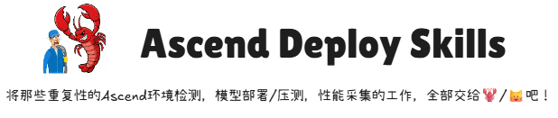
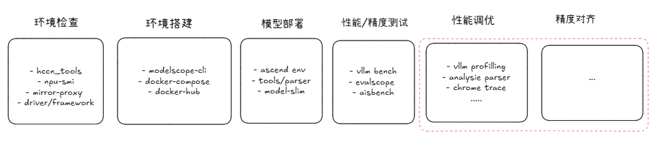

# Ascend Deploy Skills

<p align="center">
  
</p>

A skills collection focused on **LLM deployment** for Huawei Ascend NPU.

Compatible with Claude Code, OpenClaw, OpenCode, and other AI coding assistants.

**Current Version: v0.1.0** | [Changelog](./CHANGELOG.md) | [中文文档](./README-ZH.md)

## Deployment Workflow

<p align="center">
  
</p>

## Installation

Clone the repository and ask your AI assistant to install:

```bash
git clone https://github.com/leow3lab/ascend-skills.git

Please install the skills from the ascend-skills repository I just cloned
```

## Update

- **v0.1.0** (2026-03-27) - Initial public release with 9 Ascend NPU deployment skills

## Skills Overview

### Model Deployment (ascend-deploy)

| Skill | Description |
|-------|-------------|
| **vllm-ascend-deploy** | Deploy LLM models using vLLM on Ascend NPU |
| **aisbench-perf-acc** | vLLM model accuracy and performance benchmarking |
| **evalscope-perf-acc** | Comprehensive LLM evaluation framework EvalScope |
| **modelscope-cli** | Model download tool from ModelScope community |

### Environment Configuration (ascend-env)

| Skill | Description |
|-------|-------------|
| **docker-env** | Ascend NPU environment setup in Docker containers |
| **hccn-tools** | HCCN network configuration and diagnostics |
| **hccl-bench** | HCCL cluster communication performance benchmarking |
| **mirror-proxy** | Mirror source and proxy configuration tools |

### Performance Optimization (ascend-optim)

| Skill | Description |
|-------|-------------|
| **vllm-ascend-prof** | vLLM inference performance profiling and monitoring on Ascend NPU |

## Usage Examples

After installation, skills are automatically triggered based on your needs:

- Deploy vLLM model → `vllm-ascend-deploy` auto-triggered
- Check NPU performance → `vllm-ascend-prof` auto-triggered
- Run model benchmarks → `aisbench-perf-acc` auto-triggered
- Configure NPU environment → `hccn-tools`, `docker-env` auto-triggered

## Learning Resources

We share our development experiences and best practices in the [docs](./docs/) directory:

- [Skills Development Experience](./docs/awesome-skills-experience.md) - Lessons learned from building Claude Code Skills

## Internal Tools

The `tools/` directory contains internal development tools (not installed with the plugin):

- **commit-scan** - Pre-commit security scanner for detecting sensitive information

## References

### Official Resources

- [Ascend Community](https://www.hiascend.com) - Huawei Ascend Developer Community
- [CANN Documentation](https://www.hiascend.com/document) - CANN Framework Official Docs
- [Ascend Hub](https://www.hiascend.com/developer/ascendhub) - Official Docker Images
- [Ascend Open Source](https://gitcode.com/Ascend) - Ascend Open Source Projects

### Community Resources

- [Awesome Ascend Skills](https://github.com/ascend-ai-coding/awesome-ascend-skills) - Curated list of Ascend skills and resources
- [ClawHub](https://clawhub.com) - Ascend developer community and resources
- [Skills.sh](https://skills.sh) - Skills documentation and tutorials

## Repository

https://github.com/leow3lab/ascend-skills

## License

MIT License